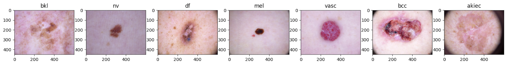
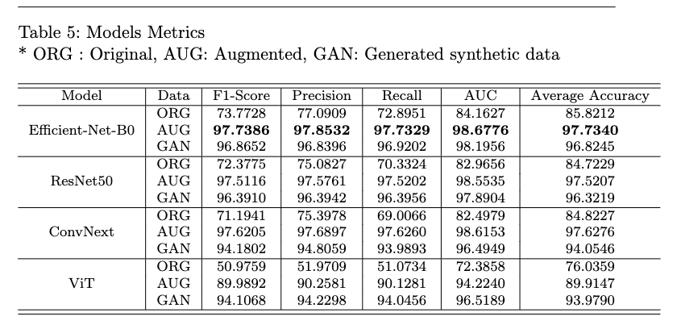

# Dermoscopic Image Classification

This repository is corresponding to the paper (refrence paper) and it contains the source code and implementation of published study. 
    




### Abstract


- Dermoscopy is a noninvasive way to examine and diagnose skin
lesions, such as nevus and melanoma, and is a critical step for skin cancer de-
tection. Accurate classification of dermoscopic images can detect skin cancer
at an early-stage and bring huge social and economic impact to patients and
communities. Using deep learning methods to classify dermoscopic images has
shown superior performance, but existing research often overlooks the class
imbalance in the data. In addition, although a handful of public datasets are
available for skin cancer research, these datasets are in general not large enough
for deep learning algorithms to produce accurate results. In this paper, we pro-
pose to use data augmentation and generative adversarial networks (GAN) to
tackle class-imbalanced dermoscopic image classification. Our main objectives
are to determine how state-of-the-art fine-tuned deep learning models per-
form on class-imbalanced dermoscopic images, whether data augmentation and
GAN can help alleviate class imbalances to improve classification accuracy, and
which method is more effective in addressing class imbalance. By using public
datasets and a carefully designed framework to generate augmented images
and synthetic images, our research provides clear answers to these questions


# Quick Links

## Dataset EDA 

- Data ReadMe file [Data ReadMe](docs/data.md) describes the dataset used in this study and provides link to download the dataset needed to replicate our study. 

- We also show data distribution after augmentation and after synthetic image generation using AC-GAN.


## Models

- Models ReadMe file contains all the information about the models used in this study.

- Implementation and training of AC-GAN

# Setup

- Clone GitHub Repository 

    `git clone [repo link]`

- Create Environment 

    We used conda environment for our virtual environment 

    `conda create -n dermcv python=3.7 -y`
    
    `conda activate dermcv`
    
- Install Dependencies 
    `pip install -r requirements.txt`

- Install Pytorch with GPU
Verify that you pytorch is installed and cuda is configured.

`pip install torch==1.12.0+cu116 torchvision==0.13.0+cu116 torchaudio==0.12.0 --extra-index-url https://download.pytorch.org/whl/cu116
`

- Verify Pytorch has Cuda
```
import torch
torch.cuda.is_available()

```
# Repository Structure

    ├── README.md
    ├── csv
    ├── data
    ├── logs
    ├── models
    ├── notebooks
    │   ├── GAN-Augmentation.ipynb
    │   └── data_explration.ipynb
    ├── requirements.txt
    ├── save
    └── src
        ├── GAN-PyTorch.py
        ├── config.py
        ├── dataset.py
        ├── imports.py
        ├── models.py
        ├── train.py
        └── utils.py


    
## Running

#### Training
`train.py` contain all the training scripts while the parameters used are located in the `config.py`. To make changes to the parameters just change the default values in the `config.py` or pass it with the training script. 
```
python train.py 
```


## Preprocessing
1. Augmentation
2. Generative Adversarial Networks


### GAN Training
We used AC-GAN to generate Images. It needs to be trained on the minority class image that needs to be extracted from the meta file on the HAM10k meta file. Data folder should contain a single folder  named HAM10k that contains all the images, while the meta files should be placed in the csv folder as train/test.

```
python GAN-Pytorch.py --data your-data-folder --csv_files csv-files-folder --n_epochs epochs --batch_size 64 --n_classes minority-classes 
```

## Models to be used

1. Efficientnet
2. ViT
3. ConvNext
4. ResNet50
5. CNN

## Contribution
@malsaidi @mjan2021

## Contact